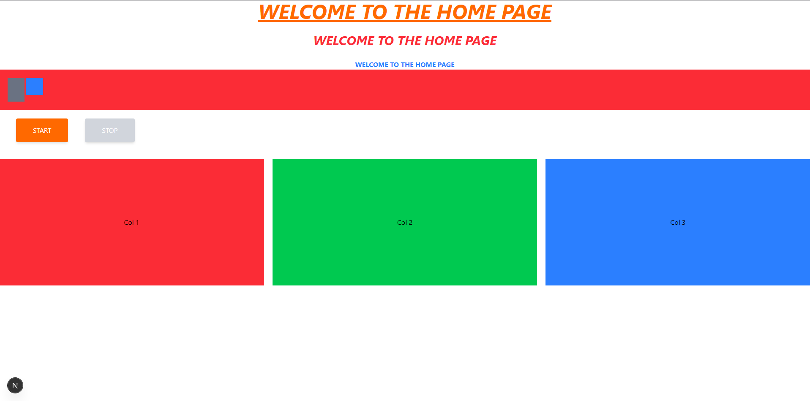

# JavaScript
---
## Spis treści

- [Podstawy](#podstawy)
  - [Funkcje Anonimowe i Strzałkowe](#funkcje-anonimowe-i-strzałkowe)
  - [Wykorzystanie `bind`, `call` i `apply`](#wykorzystanie-bind-call-i-apply)
  - [Manipulacja DOM (Document Object Model)](#manipulacja-dom-document-object-model)
  - [innerHTML vs textContent](#innerhtml-vs-textcontent)
  - [Rodzaje zdarzeń](#rodzaje-zdarzeń)
  - [jQuery](#jquery)
- [Tailwind CSS](#tailwind-css)
  - [Najważniejsze skróty](#najważniejsze-skróty)

---
## Podstawy
### Funkcje Anonimowe i Strzałkowe

**Funkcje Anonimowe** - funkcje bez nazwy, które są zazwyczaj używane jako `callbacki` (funkcje przekazywane jako argumenty do innych funkcji) lub do natychmiastowego wykonania

```js
document.addEventListener('click', function() {
    console.log("Kliknięto!");
});
```

**Funkcje Strzałkowe** - nowoczesna, skrócona składnia funkcji anonimowych

```js
// Skrócony zapis
const suma = (a, b) => a + b;

// Zastępuje funkcję anonimową w callbacku
setTimeout(() => {
    console.log("Po 1s");
}, 1000);
```

### Wykorzystanie `bind`, `call` i `apply`
Te trzy metody służą do **jawnego ustawiania wartości słowa kluczowego** `this` wewnątrz funkcji. Jest to kluczowe w OOP i podczas pracy z callbackami.

 - `call()` - Wywołuje funkcję **natychmiast**. Argumenty są przekazywane pojedynczo, po pierwszym argumencie (`this`).

- `apply()` - Wywołuje funkcję **natychmiast**. Argumenty są przekazywane w formie tablicy (lub obiektu podobnego do tablicy), po pierwszym argumencie (`this`).
  
- `bind()` - Nie wywołuje funkcji. Tworzy jej **nową kopię** ze **stałym**, przypisanym kontekstem this, którą można wywołać później. Argumenty są przekazywane pojedynczo (częściowe zastosowanie funkcji - currying).

Przykład:
```js
const osoba = { imie: "Anna" };

function powitaj(pozdrowienie, czas) {
  // Wewnątrz tej funkcji, 'this' to obiekt, który podamy przez call/apply/bind
  console.log(`${pozdrowienie}, ${this.imie} jest już ${czas}!`);
}

powitaj.call(osoba, "Cześć", "rano"); // Cześć, Anna jest już rano!

powitaj.apply(osoba, ["Dzień dobry", "popołudnie"]); // Dzień dobry, Anna jest już popołudnie!

const powitajAne = powitaj.bind(osoba, "Witaj");
powitajAne("rano"); // Witaj, Anna jest już rano!
```

### Manipulacja DOM (Document Object Model)

- `querySelector()` - zwraca pierwszy element pasujący do selektora CSS
- `querySelectroAll()` - zwraca wszystkie dopasowania

Zarówno `querySelector()` jak i `querySelectorAll()` zgłaszają wyjątek SYNTAX_ERR jeśli selektory są nieprawidłowe

```js
let selektor = document.getElementById("id")
let selektor = document.querySelector("#id")

let selektor = document.getElementsByTagName("p")
let selektor = document.querySelectorAll("p")

let selektor = document.getElementsByClassName("nazwaKlasy")
let selektor = document.querySelectorAll(".nazwaKlasy")
```

### innerHTML vs textContent

`textContent` - traktuje wszystko jako czysty tekst
`innerHTML` - traktuje wszystko jako kod HTML

`element.attribute` -> nowa wartość zmienia wartość atrybutu elementu HTML
`element.style.property` -> nowa wartość zmienia wartość właściwości CSS

---
### Rodzaje zdarzeń
**Typ zdarzenia**
- click
- mouseover

**Element zdarzenia**
- tekst
- przycisk
- formularz

**Funkcja obsługująca zdarzenie**
- listener
- handler

**Przypisanie funkcji pod zdarzenie:**
```js
document.getElementById("g1").onclick = () => {
    alert("Kliknięto przycisk 1")
}
```
**Użycie funkcji addEventListener:**
```js
let pole = document.getElementById("g2")
pole.addEventListener("click", () => {
    alert("Kliknięto przycisk 2")
})
// lub
pole.addEventListener("click", nazwaFunkcji)
```

### jQuery
To biblioteka JavaScript, która upraszcza manipulację DOM, obsługę zdarzeń i animacje.

```js
$(document).ready(function() {
    $("#przycisk").click(function() {
        alert("Kliknięto przycisk!");
    });
});
```
`$(document).ready(function() { ... })` - kod wewnątrz tej funkcji zostanie wykonany, gdy cały dokument HTML zostanie w pełni załadowany i przetworzony.

`$("#przycisk")` - działa jak `document.getElementById("przycisk")`, wybiera element o podanym ID.

---
## Tailwind CSS

```tsx
export default function HomePage() {
	return (
		<main className="bg-white">
			<section className="space-y-7">
				<p className="text-center text-5xl font-bold uppercase italic underline text-orange-500">
					Welcome to the Home Page
				</p>
				<p className="text-center text-3xl font-bold uppercase italic text-red-500">
					Welcome to the Home Page
				</p>
				<p className="text-center text-1xl font-bold uppercase text-blue-500">
					Welcome to the Home Page
				</p>
			</section>
			<section>
				<div className="relative bg-red-500 w-full h-24">
					<div className="absolute left-5 top-5 bg-gray-500 h-14 w-10"></div>
					<div className="absolute left-16 top-5 bg-blue-500 size-10"></div>
				</div>
			</section>
			<button className="bg-orange-500 uppercase text-white px-10 py-4 rounded ml-10 my-5 hover:bg-orange-800 transition shadow-md focus-visible:outline-2 focus-visible:outline-offset-4 focus-visible:outline-red-500">
				Start
			</button>
			<button disabled className="disabled:bg-gray-300 disabled:cursor-not-allowed bg-orange-500 uppercase text-white px-10 py-4 rounded ml-10 my-5 hover:bg-orange-800 transition shadow-md focus-visible:outline-2 focus-visible:outline-offset-4 focus-visible:outline-red-500">
				Stop
			</button>
      <section>
      <div className="my-5 grid md:grid-cols-3 gap-5 text-center h-[300px] [&_div]:flex [&_div]:items-center [&_div]:justify-center">
					<div className="bg-red-500">Col 1</div>
					<div className="bg-green-500">Col 2</div>
					<div className="bg-blue-500">Col 3</div>
				</div>
			</section>
		</main>
	);
}

```
Wygląd na stronie:


Oto zestawienie najważniejszych klas z Twojego kodu w formacie Markdown, gotowe do skopiowania jako notatka:

### Najważniejsze skróty

**1. Odstępy (Spacing)**
* **`p-` / `m-`** – Padding (wewnętrzny) / Margin (zewnętrzny).
* **`x` / `y`** – Oś pozioma (lewo-prawo) lub pionowa (góra-dół).
    * `px-10` – Padding poziomy.
    * `py-4` – Padding pionowy.
    * `my-5` – Margines pionowy (góra i dół).
    * `ml-10` – Margines tylko z lewej (`margin-left`).
* **`space-y-7`** – Automatycznie dodaje odstęp (`margin-top`) między wszystkimi elementami wewnątrz kontenera (oprócz pierwszego).

**2. Typografia (Text)**
* **`text-center`** – Wyśrodkowanie tekstu.
* **`text-5xl` / `text-1xl`** – Rozmiar czcionki (skala od `xs` do `9xl`).
* **`font-bold`** – Pogrubienie (font-weight: 700).
* **`uppercase`** – Zamiana na wielkie litery (`text-transform: uppercase`).
* **`italic` / `underline`** – Kursywa / Podkreślenie.

**3. Kolory (Colors)**
* **`bg-{kolor}-{odcień}`** – Kolor tła (np. `bg-red-500`, `bg-white`).
* **`text-{kolor}-{odcień}`** – Kolor tekstu (np. `text-orange-500`).

**4. Layout i Pozycjonowanie**
* **`w-full`** – Szerokość 100%.
* **`h-24`** – Wysokość zdefiniowana w skali (tutaj 6rem / 96px).
* **`size-10`** – Ustawia jednocześnie `width` i `height` na tę samą wartość.
* **`relative`** – Pozycjonowanie relatywne (dla rodzica).
* **`absolute`** – Pozycjonowanie absolutne (dla dziecka, względem rodzica `relative`).
    * `top-5`, `left-5` – Przesunięcie elementu absolutnego.

**5. Siatka (Grid)**
* **`grid`** – Aktywuje `display: grid`.
* **`gap-5`** – Odstęp między komórkami siatki.
* **`md:grid-cols-3`** – Responsywność: na ekranach średnich (`md` i większych) ustawia 3 kolumny.

**6. Stany i Interakcja (Prefixy)**
* **`hover:`** – Styl po najechaniu myszką (np. `hover:bg-orange-800`).
* **`disabled:`** – Styl dla elementu z atrybutem `disabled` (np. `disabled:cursor-not-allowed`).
* **`focus-visible:`** – Styl widoczny przy nawigacji klawiaturą (Tab).
* **`transition`** – Płynne przejścia między zmianami stylów.

**7. Zaawansowane (Special)**
* **`h-[300px]`** – **Arbitrary Value**. Użycie nawiasów kwadratowych `[]` pozwala wpisać własną wartość spoza skali Tailwinda.
* **`[&_div]`** – **Arbitrary Variant**. Pozwala stylować bezpośrednio dzieci elementu.
    * `[&_div]:flex` – Oznacza: *"Dla każdego diva wewnątrz tego elementu ustaw `display: flex`"*.
